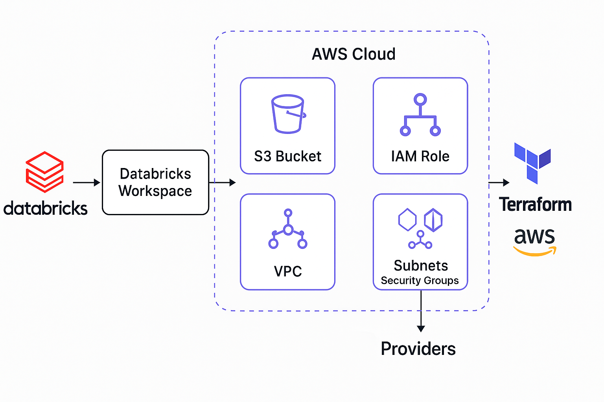

# Databricks on AWS using Terraform

This repository contains Terraform configuration files to deploy a **Databricks Workspace** on **AWS** using the [Databricks Terraform provider](https://registry.terraform.io/providers/databricks/databricks/latest) and AWS resources.

---

## Architecture



---

## Files Overview

| File               | Description                                                  |
|--------------------|--------------------------------------------------------------|
| `versions.tf`      | Specifies Terraform and provider versions                    |
| `aws.tf`           | Creates S3 bucket and IAM role needed for Databricks         |
| `databricks.tf`    | Configures the Databricks workspace and supporting resources |
| `variables.tf`     | Declares input variables used across modules                 |
| `terraform.tfvars` | Values for variables (customize this for your environment)   |

---

## Prerequisites

- Terraform ≥ 1.3.0
- AWS account with IAM access
- [Databricks account](https://accounts.cloud.databricks.com/)
- Access to a VPC, Subnets, and Security Groups in AWS

---

## Deployment Steps

1. **Clone the repo**

   ```bash
   git clone https://github.com/yourusername/databricks-aws-terraform.git
   cd databricks-aws-terraform

